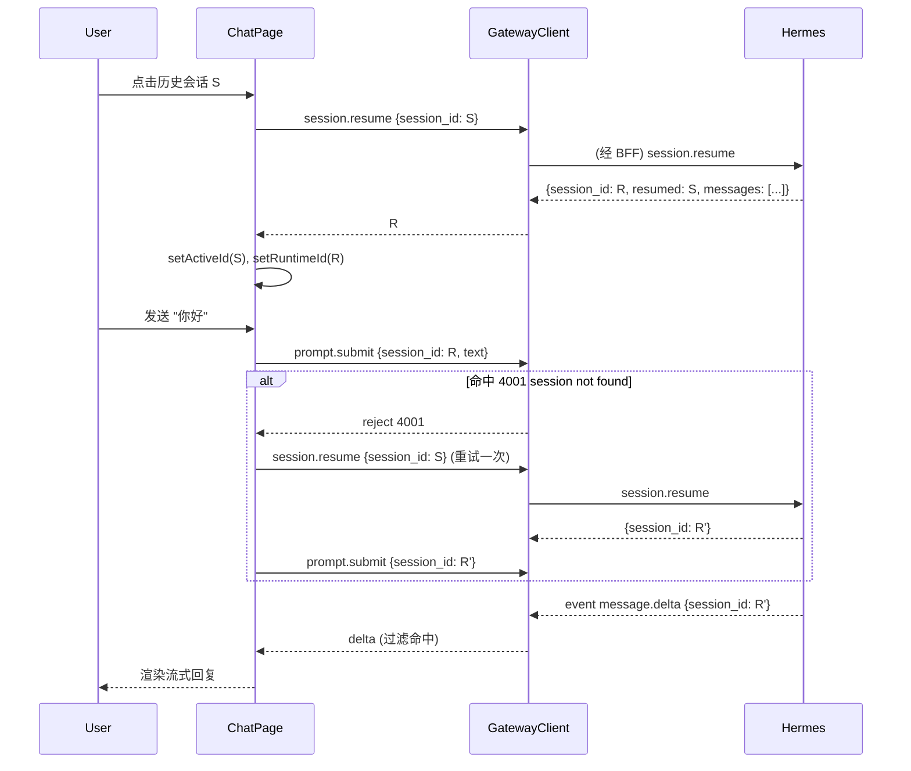

# Design: 会话双身份 (stored id / runtime id) 与自动 resume
> Spec ID: 001-chat-session-resume | Phase: design | Workflow: bugfix | Version: v1.0.0-20260929-100500

## 1. 系统架构 (mermaid)
```mermaid
graph TD
    UI[ChatPage] -->|selectSession(storedId)| ATT[attachSession]
    ATT -->|session.resume session_id=storedId| GW[GatewayClient /api/hermes/ws]
    GW --> BFF[BFF 透明代理]
    BFF --> H[hermes serve tui_gateway]
    H -->|result {session_id: runtimeId, resumed: storedId, messages}| GW
    GW --> ATT
    ATT -->|set runtimeId| UI
    UI -->|prompt.submit session_id=runtimeId| GW
    H -->|event message.delta session_id=runtimeId| GW
    GW -->|isSameSession(payload, runtimeId)| UI
```

## 2. 时序图 (mermaid)


## 3. 会话身份模型
| 名称 | 来源 | 用途 |
| --- | --- | --- |
| stored id | `session.list` 行的 `id` | 列表项 key、高亮 (`activeId`)、resume 入参 |
| runtime id | `session.resume` / `session.create` 返回的 `session_id` | 所有 session-scoped RPC；事件过滤 |
| 不变式 | — | 若存在 runtime id，任何 session-scoped RPC 必须使用它 |

## 4. 代码改动
### 4.1 `apps/web/src/chat/types.ts`
```ts
/** `session.resume` 返回的运行时会话 id（reply.session_id；缺省回退 id）。 */
export function normalizeResumedId(result: unknown): string | null {
  if (!result || typeof result !== "object") {
    return null;
  }
  const record = result as Record<string, unknown>;
  return str(record.session_id) ?? str(record.id) ?? null;
}
```

### 4.2 `apps/web/src/chat/ChatPage.tsx`
- 新增 `runtimeId` state + `runtimeIdRef`；`useEffect` 同步。
- 新增 `attachSession(storedId): Promise<string | null>`：
  ```ts
  const attachSession = useCallback(async (storedId: string) => {
    const result = await gateway.request("session.resume", { session_id: storedId });
    const runtime = normalizeResumedId(result) ?? storedId;
    setRuntimeId(runtime);
    runtimeIdRef.current = runtime;
    return runtime;
  }, [gateway]);
  ```
- `selectSession`：先 `setActiveId(id); setItems([])`，再 `attachSession(id)`；失败置错误。
- `resumeSession`：复用 `attachSession`。
- `handleSend`：`const sessionId = runtimeIdRef.current;`；catch 中：
  ```ts
  gateway.request("prompt.submit", payload).catch(async (error) => {
    if (isSessionNotFound(error) && activeIdRef.current) {
      const runtime = await attachSession(activeIdRef.current).catch(() => null);
      if (runtime) {
        return gateway.request("prompt.submit", { ...payload, session_id: runtime }).catch(() => {
          setRunning(false); setError("发送失败");
        });
      }
    }
    setRunning(false);
    setError(String(error?.message ?? "发送失败"));
  });
  ```
- 事件过滤与 `handleStop` / `session.events.since` / 附件改用 `runtimeIdRef.current`。
- 新增 `isSessionNotFound(error)`：匹配 message 含 `session not found` 或错误码 4001。

### 4.3 BFF
无需改动（`apps/server/src/hermes/proxy.ts` 透明转发）。

## 5. 错误处理
| 场景 | 行为 |
| --- | --- |
| resume 失败 | 保留列表高亮，清空 runtimeId，提示真实错误 |
| submit 4001 | 自动 resume + 重试一次 |
| 重试仍失败 | 停止 running，提示真实错误 |
| 非 4001 错误 | 不重试，直接提示 |

## 6. 测试策略
- 单测（vitest + fakeGateway）：选中→resume→运行时 id 提交；事件按运行时 id 渲染；4001→自动恢复重试；create 路径无多余 resume。
- 真机 e2e：`node scripts/e2e-real-hermes.mjs`（新建会话），并手工验证「点选历史会话→发送→看到回复」。
- 回归：`npm run check`。

## 7. 附带发现 (F2, 非本次报错)
选中会话时 `setItems([])` 且从不加载历史 → 看不到往期消息。`session.resume` 已返回 `messages`（或 `defer_history:true` + L2 `GET /api/sessions/:id/messages`），可后续按需补渲染。标记为 Ask First，不纳入本次必需范围。
