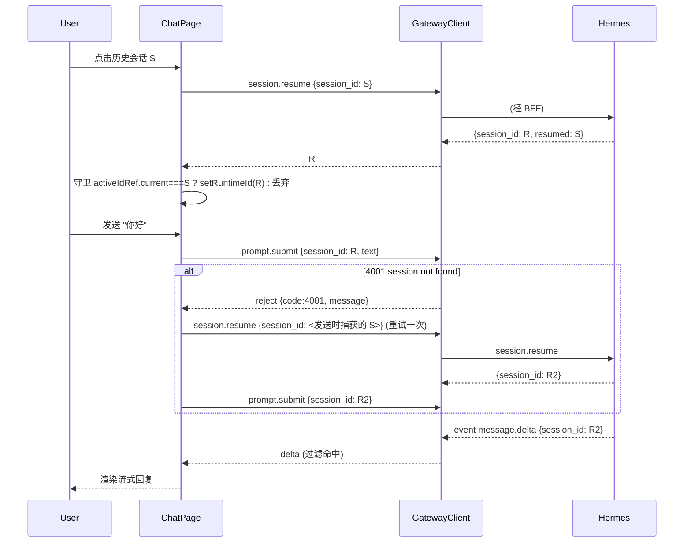

# Design: 会话双身份 (stored id / runtime id) 与有界自动 resume
> Spec ID: 001-chat-session-resume | Phase: design | Workflow: bugfix | Version: v1.1.0-20260929-101500 | Parent: v1.0.0

## 1. 系统架构 (mermaid)
```mermaid
graph TD
    UI[ChatPage] -->|selectSession(storedId)| ATT[attachSession]
    ATT -->|session.resume session_id=storedId| GW[GatewayClient /api/hermes/ws]
    GW --> BFF[BFF 透明代理]
    BFF --> H[hermes serve tui_gateway]
    H -->|result {session_id: runtimeId, resumed: storedId}| GW
    GW -->|code+message on error| ATT
    ATT -->|乱序守卫: 仍为当前 storedId 才写入| UI
    UI -->|prompt.submit session_id=runtimeId| GW
    H -->|event session_id=runtimeId| GW
    GW -->|isSameSession(payload, runtimeId)| UI
```

## 2. 时序图 (mermaid)


## 3. 会话身份模型
| 名称 | 来源 | 用途 |
| --- | --- | --- |
| stored id | `session.list` 行 `id` | 列表 key、高亮 (`activeId`)、resume 入参、4001 重试依据 |
| runtime id | `session.resume` / `session.create` 回包 `session_id` | 所有 session-scoped RPC；事件过滤；事件回放 |
| 不变式 1 | — | runtime id 必须来自 resume/create 回包；归一化失败即失败（禁止 fail-open 为 stored id） |
| 不变式 2 | — | 写入 runtime id 前，对应 stored id 必须仍是当前选中会话（乱序守卫） |

## 4. 证据（为什么 events.since 用运行时 id）
- `tui_gateway/server.py:665-668` `_event_frame`：`params = {"type": event, "session_id": sid, ...}` —— 事件携带发出时的 sid。
- `tui_gateway/event_replay.py:57` `_stamp_event`：`sid = params.get("session_id")`，ring 按该值分桶。
- 结论：`session.events.since` 必须传**运行时 id**，否则命中不到 ring（返回空），并非报错。

## 5. 代码改动
### 5.1 `apps/web/src/chat/types.ts`
```ts
/** `session.resume` 返回的运行时 id；缺失返回 null（调用方必须失败，不得回退存储 id）。 */
export function normalizeResumedId(result: unknown): string | null {
  if (!result || typeof result !== "object") {
    return null;
  }
  const record = result as Record<string, unknown>;
  return str(record.session_id) ?? str(record.id) ?? null;
}
```

### 5.2 `apps/web/src/api/ws.ts`
在 `dispatch` 的响应分支（约 85-88 行）：rejection 附带 `code`。
```ts
if (frame.error) {
  const err = new Error(String(frame.error.message ?? frame.error));
  (err as Error & { code?: number }).code = frame.error.code;
  pending.reject(err);
} else {
  pending.resolve(frame.result);
}
```
并新增 `export function isSessionNotFound(error: unknown): boolean`（优先 `code === 4001`，回退 `/session not found/i`）。

### 5.3 `apps/web/src/chat/ChatPage.tsx`
- 新增 `runtimeId` state + `runtimeIdRef`。
- `attachSession(storedId)`：resume → `normalizeResumedId`；为 null 则 `throw new Error("会话恢复失败：响应缺少运行时 id")`；**绝不** `?? storedId`。
- **乱序守卫**：在 `setRuntimeId` 前检查 `activeIdRef.current === storedId`，否则丢弃。
- `selectSession(storedId)`：`setActiveId(storedId); setItems([]);` 然后 `attachSession(storedId)`；catch 置错误。
- `resumeSession` 复用 `attachSession`。
- `handleSend(text)`：捕获 `const storedId = activeIdRef.current;` 与 `let sessionId = runtimeIdRef.current;`；若 `sessionId` 为空先 `attachSession(storedId)`。`catch`：
  ```ts
  if (isSessionNotFound(error)) {
    const runtime = await attachSession(storedId).catch(() => null);
    if (runtime) {
      return gateway.request("prompt.submit", { ...payload, session_id: runtime })
        .catch((e) => { setRunning(false); setError(String((e as Error)?.message ?? "发送失败")); });
    }
  }
  setRunning(false);
  setError(String((error as Error)?.message ?? "发送失败"));
  ```
  （以**发送时**的 storedId 重试，而非读取当前 activeId）
- 事件过滤 / `handleStop` / `session.events.since` / 附件改用 `runtimeIdRef.current`。

### 5.4 BFF
无需改动。

## 6. 错误处理
| 场景 | 行为 |
| --- | --- |
| resume 归一化失败 | runtimeId 保持 null，提示真实错误；不得用存储 id 继续 |
| resume 响应迟到 | 丢弃（乱序守卫） |
| submit 4001 | 以发送时 storedId 自动 resume + 重试一次 |
| resume 自身 4001 | 不递归；直接提示 |
| 非 4001 错误 | 不重试，直接提示 |

## 7. 测试策略
- 单测（vitest + fakeGateway）：选中→resume→运行时 id 提交；事件按运行时 id 渲染；4001→以发送时 storedId 自动恢复重试一次；归一化失败→报错且 runtimeId 为 null；乱序响应→不覆盖。
- 单测（ws.test.ts）：rejection 携带 `code`；`isSessionNotFound` 判 4001 与文案回退。
- 真机：`node scripts/e2e-real-hermes.mjs`；手工验证「点选历史会话→发送→可见回复」，且网关无 4001 WARN。
- 回归：`npm run check`。

## 8. 附带发现 (F2, 非本次报错)
选中会话时 `setItems([])` 且不加载历史 → 看不到往期消息。`session.resume` 已返回 `messages`（或 `defer_history:true` + L2 `GET /api/sessions/:id/messages`），按需后续补渲染。Ask First，不纳入本次必需范围。
