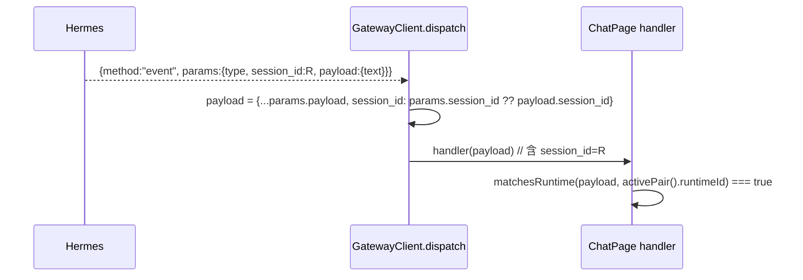

# Design (patch v1.4.1): 事件帧 session_id 透传
> Spec ID: 001-chat-session-resume | Version: v1.4.1-20260929-134500 | Parent: v1.4.0

## 1. 数据流（修正后）

Before: `handler(params.payload)` — `session_id` lost → filter always false.

## 2. 代码改动 `apps/web/src/api/ws.ts`
```ts
// frame type
params?: { type?: string; payload?: Record<string, unknown>; session_id?: string; sessionId?: string };
...
if (frame.method === "event") {
  const type = frame.params?.type;
  if (type) {
    const raw = frame.params?.payload;
    const payload: Record<string, unknown> = { ...(raw && typeof raw === "object" ? raw : {}) };
    const sid = frame.params?.session_id ?? frame.params?.sessionId;
    if (typeof sid === "string" && payload.session_id === undefined) {
      payload.session_id = sid;
    }
    for (const handler of this.handlers.get(type) ?? []) {
      handler(payload);
    }
  }
  return;
}
```

## 3. 影响
- `ChatPage` 的事件过滤（`matchesRuntime`）恢复为可命中；`message.delta/complete`、`tool.*`、`thinking`、`done`、`error` 均正常渲染。
- `server.events.since` 回放与 `pending_requests` 不受影响。
- 无 BFF 改动。

## 4. 测试
- `ws.test.ts` 新增 2 条：真实形状帧的 `session_id` 透传；payload 已含 `session_id` 时不覆盖。
- `ChatPage.test.tsx` 既有用例不变（它们直接投喂 payload）。
