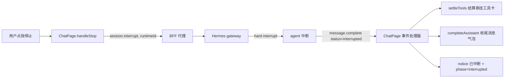
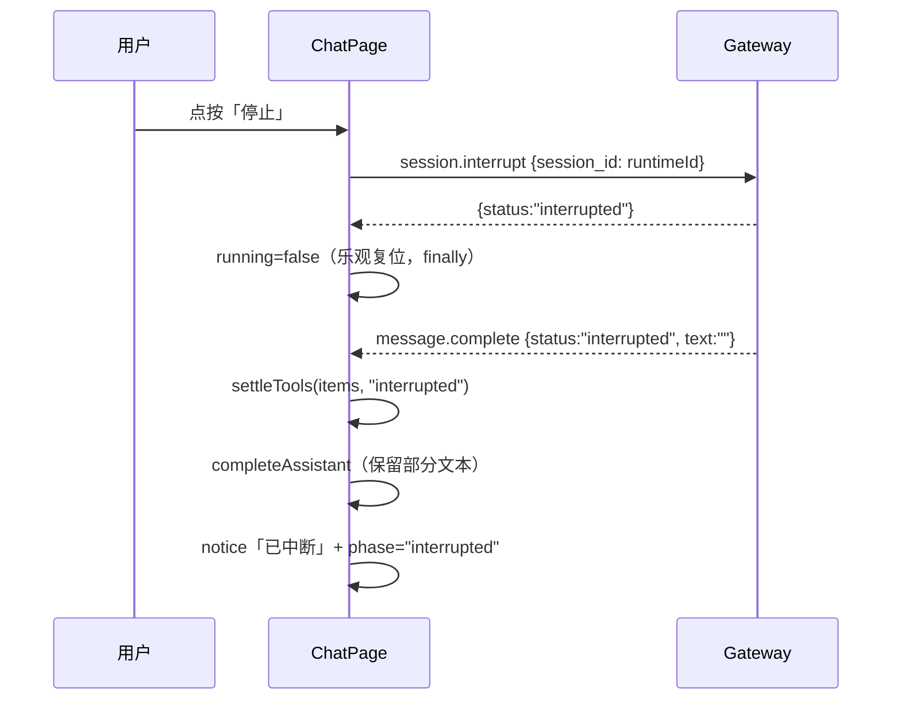

# Design: 打断（停止）回合的收尾与呈现
> Spec ID: 002 | Phase: design | Version: v1.0.0-20260929-164500

## 1. System Architecture



无新增层、无新增依赖；改动全部落在既有事件处理与渲染路径。

## 2. Sequence Diagrams



## 3. Technology Stack

无新增。TypeScript strict + React 19 + 既有 vitest/@testing-library + `fakeGateway` 测试替身。

## 4. Data Model

```ts
export type ToolStatus = "start" | "generating" | "complete" | "interrupted";

export interface StatusInfo {
  phase: "thinking" | "done" | "error" | "interrupted";
  /* …既有字段不变… */
}

export type TranscriptItem =
  | { kind: "message"; /* …不变… */ }
  | { kind: "tool"; id: string; name: string; status: ToolStatus; detail?: string; result?: string }
  | { kind: "notice"; id: string; level: "done" | "error" | "interrupted"; text: string };
```

新增纯函数（`apps/web/src/chat/types.ts`）：

```ts
/** `message.complete.status` 归一化；缺失/未知一律按 complete（向后兼容）。 */
export function turnStatus(payload: Record<string, unknown>):
  "complete" | "error" | "interrupted";

/** 把仍处于 start/generating 的工具卡结算为终态。 */
export function settleTools(
  items: TranscriptItem[],
  status: Extract<ToolStatus, "complete" | "interrupted">,
): TranscriptItem[];
```

## 5. API Design

| RPC / 事件 | 身份键 | 本规格用途 |
|-----------|--------|-----------|
| `session.interrupt` | **runtime id**（入参 `session_id`） | 停止；读回包 `status` 区分 `interrupted` / `not_interrupted` |
| `message.complete` | `params.session_id` = runtime id | 按 `status` 分支收尾 |

不改任何 BFF 路由，不改 L2 契约。

## 6. Error Handling

| 情形 | 行为 |
|------|------|
| `session.interrupt` RPC 失败 | 保留既有文案「无法中断」，`running=false`（乐观复位，避免卡死），不新增提示类型 |
| 回包 `not_interrupted` | 静默（会话已不在运行，无需提示） |
| `message.complete.status === "error"` | 结算工具卡；`phase="error"` 并带 `payload.error`；**不新增 notice**（避免与 `error` 事件重复提示） |
| `status` 缺失/未知 | 按 `complete`（P4 向后兼容） |
| 非活动会话事件 | `matchesRuntime` 守卫直接 return（既有行为，P3 覆盖） |

**乐观复位取舍**：`handleStop` 在 `finally` 里 `setRunning(false)`，保证 RPC 失败或事件丢失时 UI 不卡死；`message.complete` 到达时再次幂等复位（P1）。

## 7. Testing Strategy

| 层 | 用例 |
|----|------|
| 纯函数单测（`types.test.ts` 或既有工具测试文件） | `turnStatus` 四分支（P4）；`settleTools` 结算 start/generating、不动 complete、保留 detail/result |
| 组件单测（`ChatPage.test.tsx`） | REQ-001 回包复位；REQ-002 「已中断」+ 状态标签；REQ-003 悬挂工具卡结算；REQ-004 身份未就绪不发 RPC；REQ-005 部分文本保留（P1 幂等重放） |
| 集成测试（`ChatPage.integration.test.tsx`，走 `fakeGateway`） | 完整序列 tool.start → generateing → message.complete(interrupted) 后无悬挂工具卡（P2） |
| 回归 | 既有 `message.complete`（无 status）用例保持通过 |
