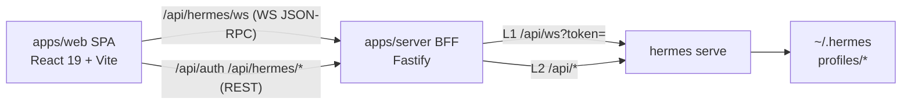
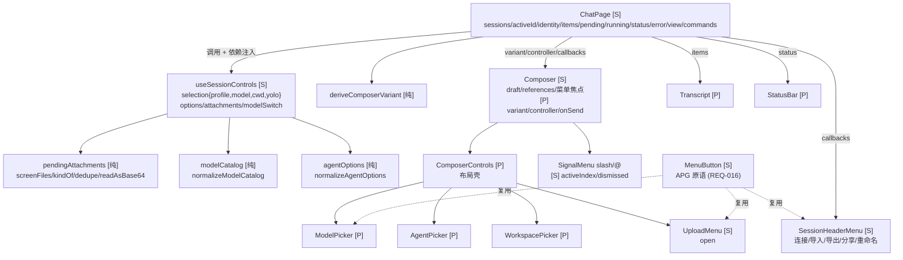
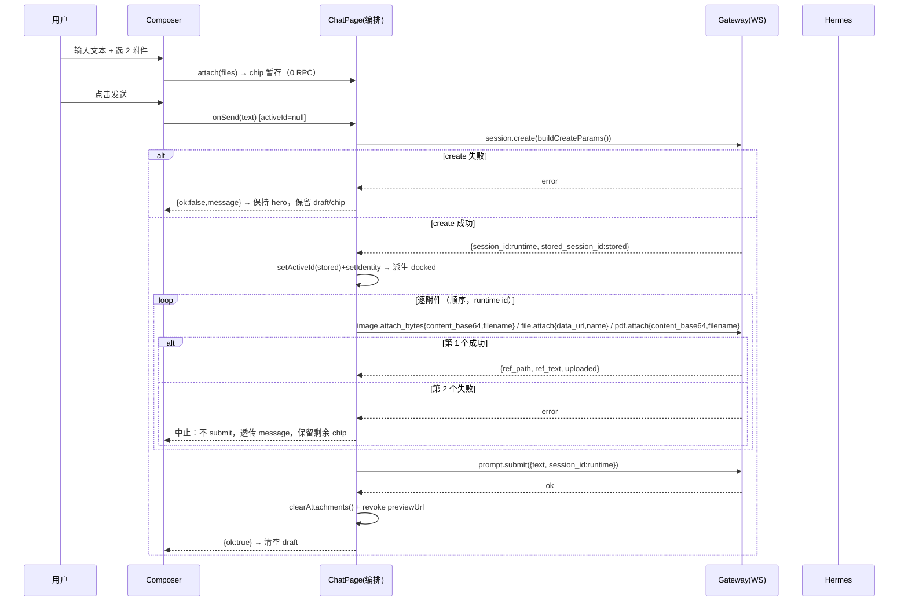
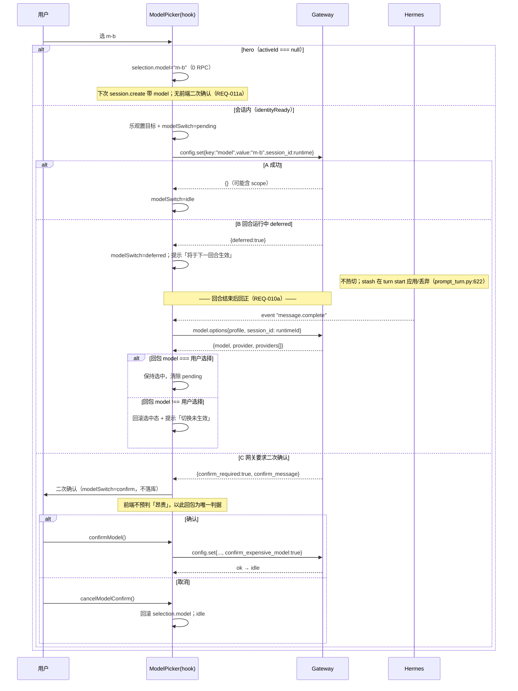
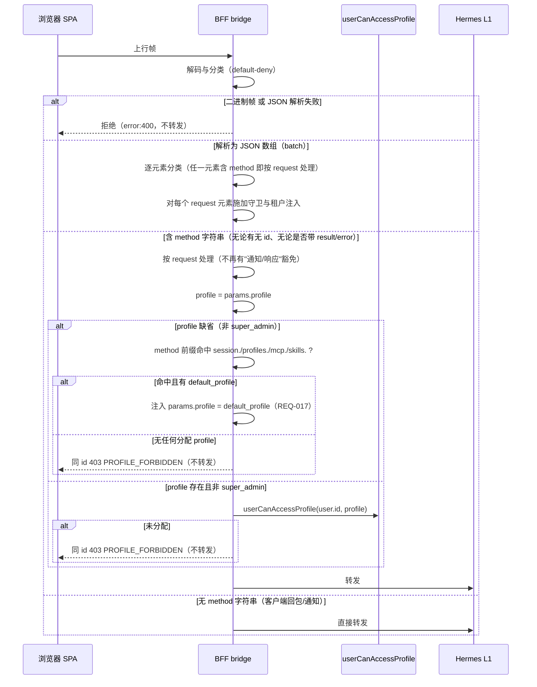
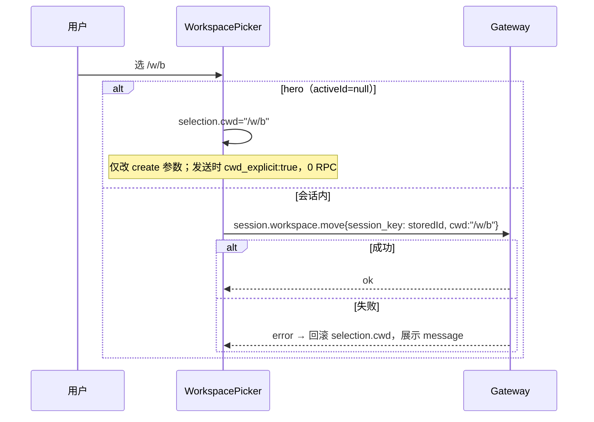

# Design: 对话页重构（hero/docked + 会话控件 + WS 租户守卫）

> Spec ID: 003-composer-redesign | Phase: design | Version: v1.0.0-20260929-173000
> 输入：`requirements.md`（同目录，**27 条 REQ 条目**：REQ-001..023 + 后缀 010a / 011a / 018a / 018b）+ Gate 2 已确认的 4 节设计

## 1. 系统架构

### 1.1 分层与职责（沿用既有架构，不新增框架）



本次改动只落在 SPA 与 BFF 两层，**不改 Hermes**（契约已支持全部所需能力）。

### 1.2 组件架构与状态归属

图例：`[S]`=持有 state；`[P]`=只接 props（受控）；`[纯]`=无 state 纯逻辑。



### 1.3 状态归属决策

| 状态 | 归属 | 理由 |
|---|---|---|
| `sessions / activeId / identity / items / pending / running / status / error / view / commands` | **ChatPage** | 会话运行时唯一真相源；事件订阅与发送编排的宿主；跨 header/composer/transcript 共享 |
| `selection{profile,model,cwd,yolo}` | **useSessionControls** | 控件域内聚；`handleSend` 只需读 `buildCreateParams()`，避免 4 个 setter 铺进 ChatPage |
| `options{agents,models,workspaces}` + loading | **useSessionControls** | 生命周期 = 每会话 ≤1 次；与控件强绑定；避免 ChatPage 再爆 3 个 state |
| `attachments: PendingAttachment[]` | **useSessionControls** | 与 selection 同属「待发送表单」；`uploadAll(runtimeId)` 由 hook 提供 |
| `modelSwitch{status,message}` | **useSessionControls** | `deferred`/`confirm` 是模型控件的异步分支，不该污染 turn 态 |
| `draft / references / 菜单开合 / activeIndex` | **Composer** | 按键级 UI；无跨组件消费方 |
| `SessionHeaderMenu.open` / `UploadMenu.open` / `MenuButton.open` | 各自组件 | 纯本地浮层 |

**边界原则**：ChatPage 不感知控件内部结构（只拿 controller 对象）；控件不写会话运行时（只通过 controller 暴露的 RPC 动作影响）；`identity`/`running` 单向传入 hook（只读），杜绝重复真相源。

### 1.4 双态派生（纯函数，禁止条件渲染两个组件）

```ts
export type ComposerVariant = "hero" | "docked";

export function deriveComposerVariant(input: {
  activeId: string | null;
  itemCount: number;
}): ComposerVariant {
  return input.activeId === null && input.itemCount === 0 ? "hero" : "docked";
}
```

**不变量**：hero 与 docked 互斥且穷尽；`hero ⟺ activeId===null && itemCount===0`。

| 场景 | 结果 | 说明 |
|---|---|---|
| 切会话中途 | docked | `selectSession` 同步 `setActiveId`；旧会话历史晚到由 `activeIdRef` 门控丢弃 |
| resume 未完成 | docked + 控件禁用 | `activeId!==null` → docked；`identityReady===false` → 禁用 + 本地拦截（REQ-014） |
| hero create 失败 | 保持 hero | `activeId` 仍 null、无乐观项；draft/chip 保留 |
| docked submit 失败 | 保持 docked | 已 append 乐观 user 项 → `itemCount>0`；按 `ui-spec.md §2` 合并/还原文本 |
| StrictMode 双渲染 | 不变 | 纯计算，幂等 |

**⚠️ 关键约束**：`Composer` 必须**单实例**、以 `data-variant` 切布局；若条件渲染两个不同组件，切换会卸载并丢失 `draft`/`chips`/`references`（违反 REQ-001/005）。hero 专属的「大标识 + 标题 + 最近会话」抽为独立 `HeroIntro`，**Composer 本体共享**。

### 1.5 技术栈与选型理由

| 层 | 选型 | 来源 | 理由 |
|---|---|---|---|
| 前端框架 | React 19 + TypeScript strict（ESM） | 既有 | 硬约束；`StrictMode` 双调用下需幂等 |
| 构建（前端） | Vite 6 | 既有 | 既有 pipeline（`tsc --noEmit && vite build`） |
| 路由 | react-router-dom 7 | 既有 | 既有 |
| 样式 | **手写 CSS** + `--ds-*` design token；圆角 `--ds-radius-*` | 既有 | **硬约束：不引 UI 库**（`AGENTS.md §8`）。`corner-shape` 超椭圆在代码中不存在，不得依赖 |
| 状态管理 | `useReducer`（纯 reducer）+ 自定义 hook；**不引** Redux/Zustand/Jotai | 新增（React 内置） | `selection` + `attachments` 天然是状态机，纯函数可穷举测试；单消费方（ChatPage），Context 属过度设计 |
| 布局响应 | CSS Container Queries（`@container chat`），回退 flex/grid | 新增（原生 CSS） | 侧栏折叠 / 详情面板让步时媒体查询感知不到容器宽度；jsdom 无布局 → 需 e2e 验证 |
| 过渡动画 | 仅 `transform` / `opacity` | 新增（原生 CSS） | 合成层，不触发布局；避免 CLS |
| 单元 / 组件测试 | Vitest 3 + `@testing-library/react` 16 + jsdom 27 | 既有 | 验证命令 `npm run check` 的一部分 |
| 属性测试 | **确定性生成器 + 边界遍历表**（不引 `fast-check`） | 新增（自写） | 仓库无该依赖，避免新增 dev 依赖；边界值可枚举 |
| E2E | Playwright | 既有 | `npm run test:e2e`，**独立跑、不进 `check`**；CLS / container query / 真实拖拽只能在真实浏览器断言 |
| BFF 框架 | Fastify | 既有 | 既有 |
| BFF ←→ Hermes WS | `ws` 库（服务端到服务端透传） | 既有 | `hermes/proxy.ts` 已有；需显式设 `maxPayload`（风险 R3） |
| 存储 | better-sqlite3（prepared statements） | 既有 | 硬约束：SQL 参数化 |
| BFF 构建 | esbuild → 单文件 ESM `apps/server/dist/server.mjs`（`packages: external`） | 既有 | 硬约束 |
| 契约 | Hermes 官方 **L1 `/api/ws` JSON-RPC** + **L2 `/api/*` REST** | 既有（官方） | **不新增任何契约**；本次全部能力（`profile` / `model` / `cwd` / `attach*` / `config.set`）均为既有原生参数 |
| 图标 | 内联 SVG / 文本字符 | 新增 | 不引图标库（`AGENTS.md §8`） |
| i18n | 仓库既有 `t()` + `i18n/zh.ts` key 注册（类型约束） | 既有 | 新增 key 必须先注册，否则 TS 编译失败 |

**新增依赖清单：无。** 本 Spec 不引入任何 npm 运行时或开发依赖（属性测试自写生成器；菜单原语手写 `MenuButton.tsx`）。

**被明确否决的选型**：

| 选项 | 否决理由 |
|---|---|
| 引入 UI 库（Radix / Headless UI / shadcn） | 违反 `AGENTS.md §8`「不引 UI 库」；菜单原语手写工作量可控（`MenuButton.tsx`） |
| React Context 承载控件状态 | 单消费方（ChatPage）；Context 会导致全子树重渲染，且 reducer 已足够可测 |
| 复用 `settings/model.ts#normalizeModelOptions` | 只认扁平 `models`/`options` 并产出 `string[]`，拿不到 `providers[].models` 与 `capabilities[].fast`；改动会牵动已验收的 T8.2 与 `ModelPanel`（见 N-011） |
| 用 `image.attach{path}` / `clipboard.paste` / `input.detect_drop` | 三者作用于**网关/宿主**侧，浏览器无对应能力（见 N-007 / N-008） |
| 走「先 REST 上传再传引用」 | 契约无此通道；需新造 BFF 路由 + 落盘 + 清理 + 跨主机路径，本期不做（登记为未来演进，见 `design.md §3` 的选型对比） |
| 引入 `fast-check` | 避免新增 dev 依赖；边界值（0 / 10MB / 10MB+1 / 第 11 个）可确定性枚举 |

---

## 2. 序列图

### 2.1 hero 首条消息（延迟绑定 + 失败分支）



### 2.2 会话内切模型（成功 / deferred / confirm / 回合结束后回正）



**对齐来源说明**：契约中**不存在 `session.info`**；`session.status` 回包仅 `{output: str}`（`contracts/sessions.py:431-440`），不可用于对齐。唯一结构化来源是 `model.options{profile, session_id: runtimeId}` 回包的 `model` / `provider`（`contracts/config_free_tier_control.py:273-277`，doc: *"layered over the session's live provider when given"*）；触发器为 **`message.complete`** 事件（`contracts/events.py:205`）。

### 2.3 BFF WS 守卫（default-deny 分类 + 越权 + 租户上下文注入）



**关键修正**：原设计把「无 `id`」「带 `result`/`error`」「数组/二进制」当作放行理由，形成 4 条可复现绕过（评审 CRITICAL #1）。现行判据只有一条：**解析后是否含 `method` 字符串**。

### 2.4 切换工作区（hero 写参数 vs 会话内 move）



## 3. 模块与接口设计

### 3.1 新增/修改文件清单

```
apps/web/src/chat/
├── Composer.tsx                    [改] + variant prop；data-variant 布局；拆出附件 chip 区
├── ChatPage.tsx                    [改] hero 分支；移除 9 按钮工具栏；发送编排改延迟绑定
├── SessionHeaderMenu.tsx           [新] 连接/导入/导出/分享/重命名
├── HeroIntro.tsx                   [新] hero 专属（大标识 + 标题 + 最近会话），Composer 共享
├── composer/
│   ├── index.ts                    [新] 导出
│   ├── ComposerControls.tsx        [新] pill 行 + 底行布局壳
│   ├── ModelPicker.tsx             [新] controlled
│   ├── AgentPicker.tsx             [新] controlled
│   ├── WorkspacePicker.tsx         [新] controlled
│   ├── PermissionPicker.tsx        [新] 权限模式（yolo）
│   ├── UploadMenu.tsx              [新] 文件/图片/PDF + 子代理/命令/上下文/人格/图片生成入口
│   ├── MenuButton.tsx              [新] APG Menu Button 原语（REQ-016）
│   ├── useSessionControls.ts       [新] 状态机 + RPC
│   ├── pendingAttachments.ts       [新] 纯函数
│   ├── modelCatalog.ts             [新] WS model.options 归一化
│   ├── agentOptions.ts             [新] me.profiles 归一化
│   └── variant.ts                  [新] deriveComposerVariant
└── (既有 SlashMenu/ReferenceMenu/工具卡/面板保持不变)

apps/server/src/hermes/
├── proxy.ts                        [改] WS 守卫：帧分类 + profile 校验 + 响应帧过滤（REQ-015）
└── proxy.test.ts                   [改] 越权/放行/响应帧用例

apps/server/src/routes/
└── hermes.ts                       [改] 抽出可复用的 profile 判定（保持 REST 行为不变）

apps/web/src/styles.css             [改] hero/docked/pill/chip/menu 样式（全 --ds-*）
apps/web/src/i18n/zh.ts             [改] 新增文案 key
apps/web/src/api/ws.ts              [改] 支持读取 error.data.code 字符串（REQ-008 可断言）
```

### 3.2 `useSessionControls` 接口

```ts
export type ModelSwitchState =
  | { status: "idle" }
  | { status: "pending"; target: string }
  | { status: "deferred"; target: string }
  | { status: "confirm"; target: string; message?: string }
  | { status: "error"; target: string; message: string };

export interface SessionSelection {
  profile: string | null;
  model: string | null;
  cwd: string | null;
  yolo: string;
}

export interface PendingAttachment {
  id: string;
  kind: "image" | "file" | "pdf";
  file: File;
  name: string;
  size: number;
  previewUrl?: string;
}

export interface UseSessionControlsArgs {
  gateway: Gateway;
  activeId: string | null;
  identity: SessionIdentity | null;
  running: boolean;
  me: { profiles: string[]; default_profile: string | null } | null;
  itemCount: number;
  onError: (message: string) => void;
}

export interface SessionControls {
  variant: ComposerVariant;
  identityReady: boolean;      // activeId!==null && identity?.storedId===activeId
  selection: SessionSelection;
  options: {
    agents: AgentOption[];
    models: ModelOption[];
    workspaces: string[];
    loading: { agents: boolean; models: boolean; workspaces: boolean };
  };
  modelSwitch: ModelSwitchState;
  confirmModel(): Promise<void>;
  cancelModelConfirm(): void;
  attachments: PendingAttachment[];
  attach(files: File[]): void;
  removeAttachment(id: string): void;
  clearAttachments(): void;
  /** 逐条 attach*，fail-fast；**single-flight**：发送进行中重复调用为 no-op */
  uploadAll(runtimeId: string): Promise<void>;
  /** 发送编排入口；**single-flight**：进行中重复调用返回同一 Promise，不重复 create */
  send(text: string): Promise<SendOutcome>;
  selectProfile(name: string | null): void;
  selectModel(name: string): Promise<void>;
  selectWorkspace(path: string | null): Promise<void>;
  selectYolo(mode: string): Promise<void>;
  buildCreateParams(): {
    profile?: string;
    cwd?: string;
    cwd_explicit?: true;   // 仅显式选目录时存在
    model?: string;
  };
  /** 由 ChatPage 在收到 message.complete 时调用；仅当 modelSwitch.status==="deferred" 时发 RPC（REQ-010a） */
  reconcileModel(): Promise<void>;
  resetForNewSession(): void;
}

export type SendOutcome =
  | { ok: true }
  | { ok: false; message: string; stage: "create" | "attach" | "submit" };

export function useSessionControls(args: UseSessionControlsArgs): SessionControls;
```

**注**：原设计中的 `syncFromSession(info)` 已**删除**——契约无 `session.info`，改为 `reconcileModel()`（内部调 `model.options{profile, session_id: runtimeId}`）。

**内部结构**：`selection` + `attachments` 用 `useReducer(controlsReducer, ...)`（纯函数可穷举）；`options` / `modelSwitch` 用 `useState`；RPC 异步放在 dispatch 外层，保证 reducer 是纯函数。

### 3.3 `previewUrl` 生命周期（防内存泄漏）

- 创建：`attach()` 内仅对 `kind === "image"` 调 `URL.createObjectURL(file)`，URL 记入 `createdUrlsRef: Set<string>`。
- **恰好 revoke 一次的 4 个时机**：`removeAttachment(id)` / `clearAttachments()` / 发送成功后清 chip / hook 卸载（`useEffect(() => () => revokeAll(), [])`）。revoke 后 `delete` 该 URL（StrictMode 双 mount 下防止二次 revoke）。
- 被拒附件（>10MB / 超 10 个）**不创建** URL。
- base64 由 `FileReader.readAsDataURL` 异步产出，不阻塞主线程 > 50ms。

### 3.4 options 会话键与缓存迁移（防重复加载）

NFR 要求「选项加载每会话 ≤ 1 次」，但 hero 态 `activeId === null` → create 成功后变为 storedId，**朴素以 `activeId` 为键会加载 2 次**。

**定义**：

| 场景 | 缓存键 | 行为 |
|---|---|---|
| hero（`activeId === null`） | `"__hero__"::<profile>` | 加载 `me.profiles`、`model.options{profile}`、`chat/workspaces?profile=` |
| create 成功（拿到 storedId） | **迁移**：把 `"__hero__"::<create 时冻结的 profile>` 改键为 `<storedId>::<同一 profile>`，**不重载** | 不重载 |
| 切会话（resume） | `<storedId>::<profile>` | 未命中才加载 |
| `selection.profile` 变更 | 键的 `<profile>` 段变化 → 新条目 | 重载该 profile 的 `model.options` / `workspaces` |

**键文法**：`<sessionKey>::<profile>`，其中 `sessionKey ∈ {"__hero__"} ∪ storedId 集合`，`profile` 为**非空字符串**（无可用 profile 时不加载，见 REQ-012/019）。

**create 期间 profile 冻结**：`send()` 开始时把 `selection.profile` 冻结为 `frozenProfile`，会话创建与会话键迁移**均以 `frozenProfile` 为准**；发送进行中 `AgentPicker` shall `disabled`（避免「会话按旧 profile 建、options 按新 profile 载」的租户不一致）。

**不变量**：同一 `(sessionKey, profile)` 组合在一次页面生命周期内加载 ≤ 1 次；StrictMode 双挂载由 `Map` + `inFlight` Promise 去重。

`useSessionControls` 的 options 加载须携带 `profile` 参数（REQ-019）：`model.options{profile}`、`/api/hermes/chat/workspaces?profile=<name>`。

## 4. 数据模型与归一化

### 4.1 WS `model.options` → `ModelCatalog`（**不复用** `settings/model.ts`）

```ts
export interface ModelCapabilities { fast?: boolean; reasoning?: boolean }
export interface ModelOption {
  id: string; provider: string; label: string;
  capabilities: ModelCapabilities; authenticated: boolean;
  pricing?: { inputPerM?: number; outputPerM?: number };
}
export interface ModelCatalog {
  options: ModelOption[];
  current: { model: string | null; provider: string | null };
}
export function normalizeModelCatalog(payload: unknown): ModelCatalog;
```

| 目标 | 来源优先级 | 缺失回退 |
|---|---|---|
| provider | `providers[].slug\|id\|name\|provider` | `""` |
| model id | `providers[].models[]`（string 或对象 `id/name/model`）；顶层 `models[]`/`options[]` | 丢弃该条（**不臆造**） |
| label | 对象 `label/display_name` | = id |
| capabilities | `provider.capabilities[id].{fast,reasoning}` | `{}` |
| authenticated | `provider.authenticated ?? model.authenticated` | `false` |
| pricing | `model.pricing`（数值容错） | `undefined` |
| current | 顶层 `model` / `provider` | `null` |
| 去重键 | `${provider}::${id}` | — |

**为何不复用**：`settings/model.ts#normalizeModelOptions`（`model.ts:27-50`）只认扁平 `models`/`options` 并产出 `string[]`，**拿不到** `providers[].models` 与 `capabilities[model].fast` → `Flash` 徽标无法取值。改动它会牵动 `ModelPanel` 及其测试（T8.2 已验收）→ 新建独立模块。

### 4.2 `agentOptions` ← `/api/auth/me`

```ts
export interface AgentOption { name: string; isDefault: boolean; avatarUrl?: string }
export function normalizeAgentOptions(me: { profiles?: unknown; default_profile?: unknown } | null): AgentOption[];
```

规则：仅接受 `me.profiles` 为字符串数组；trim + 去重；`isDefault = default_profile ∈ profiles`，否则取 `profiles[0]`；缺失/非数组 → `[]`。**绝不回退 `profiles.list`**（REQ-002 不变量）。头像需另取，本期先用首字占位（`avatarUrl` 留空，实现阶段确认 `/api/auth/me` 是否带头像）。

### 4.2b `model.options` 的调用参数（REQ-019）

```
model.options{ profile: <当前 selection.profile 或 default_profile>, session_id?: <runtimeId> }
```

- hero 态：只传 `profile`（无 session）。
- 会话内：同时传 `session_id: runtimeId`，使回包 `model` 为**该会话的实时模型**（对齐用途，见 REQ-010a）。
- **不得**发起不带 `profile` 的 `model.options` 调用。

### 4.3 workspace

复用现有 `apps/web/src/chat/types.ts#normalizeWorkspaces`（`:112`），不新增。

### 4.4 新增 normalizer（`agentOptions` / `modelCatalog`）放入**新测试文件**，不动 `types.test.ts` / `settings/model.ts`。

## 5. API / RPC 设计（只用官方契约，无新契约）

| 动作 | 通道 | 方法 | 身份键 / 租户上下文 |
|---|---|---|---|
| 创建会话（hero 发送） | L1 WS | `session.create{profile?, model?, cwd?, cwd_explicit?}` | `profile` = 当前选择（非 super_admin 由 BFF 注入 default） |
| 恢复历史会话 | L1 WS | `session.resume{session_id: stored}` | 入参 stored，回包 runtime |
| 切模型（会话内） | L1 WS | `config.set{key:"model", value, session_id, confirm_expensive_model?}` | **runtime** |
| 切权限模式 | L1 WS | `config.set{key:"yolo", value, session_id, scope:"session"}` | **runtime** |
| 模型清单 / 对齐 | L1 WS | `model.options{profile, session_id?}` | **必须带 `profile`**（REQ-019） |
| 切工作区（会话内） | L1 WS | `session.workspace.move{session_key, cwd}` | **stored** |
| 上传图片 | L1 WS | `image.attach_bytes{content_base64, filename, ext?}` | **runtime** |
| 上传文件 | L1 WS | `file.attach{data_url, name}` | **runtime** |
| 上传 PDF | L1 WS | `pdf.attach{content_base64, filename}` | **runtime** |
| 发消息 | L1 WS | `prompt.submit{text, session_id}` | **runtime** |
| 重命名 | L1 WS | `session.title{session_id, title}` | **runtime** |
| 停止 | L1 WS | `session.interrupt{session_id}` | **runtime** |
| 智能体选项 | BFF REST | `GET /api/auth/me` → `{profiles[], default_profile}` | 会话 cookie |
| 工作区列表 | BFF REST | `GET /api/hermes/chat/workspaces?profile=<name>` | **必须带 `profile`**（REQ-012） |
| 已删除 | — | ~~`session.info`~~ | **不存在**；参见 `session.status`（仅 `output: str`，不可用于对齐） |
| 会话域 RPC（显式租户） | L1 WS | `session.list` / `session.most_recent` / `session.resume` / `session.events.since` 带 `params.profile` | 由前端在有选择时显式携带（REQ-020） |
| 审计 | BFF 内部 | `audit` 表写入 | actor / profile / method / ip / 结果（REQ-021） |

**错误结构**：REST `{error, message}`；WS `{jsonrpc, id, error:{code:<number>, message, data:{code:"<STRING>"}}}`。为支持 REQ-008 的命名错误码断言，需扩展 `apps/web/src/api/ws.ts:112-119` 读取 `error.data.code`。

## 6. 错误处理矩阵

| 失败点 | 错误来源 | UI 表现 | 状态回滚 | 可重试 |
|---|---|---|---|---|
| create 失败 | WS `session.create` error | 输入框容错条（`role=alert`）透传 message；保留 hero | 不建 identity；不 append 乐观项；保留 draft/chip | 是 |
| attach 失败 | WS `*.attach*` error | 透传 message；标注第几个附件失败 | 已成功的 attach 不撤销（网关侧副作用保留）；**不 submit**；保留剩余 chip | 是（复用 identity） |
| submit 失败 | WS `prompt.submit` error | 透传 message；助手气泡不出现 | docked 已 append 的乐观 user 项按 `ui-spec.md §2` 合并/回滚文本；`running=false` | 是 |
| 模型 deferred | 回包 `{deferred:true}` | 中性提示「将于下一回合生效」；目标模型高亮 | **不回滚**目标值（网关已 stash）；收到该会话的 **`message.complete`** 事件后由 `reconcileModel()` 调 `model.options{profile, session_id: runtimeId}` 并以回包 **`model`** 回正（不一致则回滚 + 提示「切换未生效」） | 否（等回合） |
| 模型 confirm 取消 | 用户点取消 | 弹窗关闭，无错误条 | `selection.model` 回滚到变更前；无落库 | 是 |
| yolo 失败 | `config.set{key:"yolo"}` error | 透传 message | 选中态回滚（REQ-013） | 是 |
| workspace.move 失败 | 回包 error | 透传 message | `selection.cwd` 回滚；会话实际 cwd 不变 | 是 |
| 10MB / 超 10 个 | 前端校验（无 RPC） | `role=alert`：「文件 X 超过 10MB 上限」；其余合法文件照常入 chip | 被拒文件不入 chip | 是 |
| WS 守卫 403 | BFF 同 id 回 `PROFILE_FORBIDDEN` | 透传「无权访问该 profile」；控件回安全值 | 不产生会话；`selection.profile` 回退到 `me.profiles` 内 | 否（换授权 profile） |
| identity 未就绪 | `identityReady===false` | 控件禁用 + 「恢复中…」；发送按钮置灰 | 本地拦截，0 条 runtime-id RPC 外发 | 是（resume 完成后放行） |
| `profiles.list` 被过滤 | REQ-015 | 智能体页对 admin 只显示已分配 profile（预期行为） | — | 否 |

> 统一：所有网关/上游 message **原样透传**，不替换为泛化文案。

## 7. 安全设计

### 7.1 WS 守卫插入点与 default-deny 判据

插入点：`apps/server/src/hermes/proxy.ts#bridge()` 的 `socket.on("message", ...)` 回调**最前面**（`:40-46`）。理由：只覆盖客户端上行帧（下行在 `:76`），天然不误拦服务端响应/事件；且在 `pending` 入队**之前**拦截，冷启动竞态下越权帧也不会在 `ws.on("open")` 冲刷时漏出。

**分类（default-deny，唯一判据 = 解析后是否含 `method` 字符串）**：

| 输入 | 判定 | 处理 |
|---|---|---|
| **二进制帧**（`isBinary === true`） | 非合法 L1 帧 | **拒绝**：回 `error:400`（可读 message），不转发 |
| 文本帧但 JSON 解析失败 | 非法 | **拒绝**：回 `error:400`，不转发 |
| JSON 数组（batch） | 逐元素分类 | 每个元素：含 `method` → 按 request 守卫 + 租户注入；**若任一元素越权 → 整批拒绝**（回 `error:{code:403, data:{code:"PROFILE_FORBIDDEN"}}`，**不转发任何元素**）；否则整批转发。**不做局部转发**（避免 id 合并与上游批支持的不确定性，Q-008） |
| JSON 对象**含 `method` 字符串**（**无论**有无 `id`、**无论**是否带 `result`/`error`） | **request** | 施加 profile 守卫（7.1.1）与租户上下文注入（7.1.2） |
| JSON 对象**不含 `method`** | 客户端回包/通知 | 直接转发（审批/secret/sudo 回包在此路径） |
| 其它（`null` / 数字 / 字符串 / 布尔） | 非法 | **拒绝** |

**禁止**的免拦理由（评审 CRITICAL #1 的 4 条绕过路径）：
1. ❌「无 `id` 所以是通知」→ 含 `method` 即 request
2. ❌「带 `result`/`error` 所以是响应」→ 含 `method` 即 request
3. ❌「数组批帧一律放行」→ 必须逐元素处理
4. ❌「二进制帧放行」→ 必须拒绝
5. ❌「方法不在豁免清单里所以算豁免」→ **未知方法必须按需 profile 处理**（注入或 403）
6. ❌「方法直继 `Params` 所以是 profile-agnostic」→ 判据是 **schema 是否声明 `profile`**

**须在 `proxy.ts` 中导出一个稳定接口供响应侧复用**：

```ts
export interface FrameClassification {
  kind: "request" | "response" | "notification" | "batch" | "invalid" | "binary";
  id?: number | string;
  method?: string;
  profile?: string;
  elements?: FrameClassification[];   // kind === "batch"
}
export function classifyFrame(data: RawData, isBinary: boolean): FrameClassification;
```

TASK-003 负责实现并导出该函数；TASK-029（响应过滤）依赖它，**不得**自行解析帧文本。

#### 7.1.1 profile 守卫（REQ-008）

- 提取 `frame.params.profile`（顶层非空字符串）。
- `super_admin` → 放行。
- `profile` 存在且非 `super_admin` → `userCanAccessProfile(db, request.user.id, profile)`（复用 `users/repo.ts:139-144`）；未分配 → 同 `id` 回 `{error:{code:403, message:"无权访问该 profile", data:{code:"PROFILE_FORBIDDEN"}}}`，**不转发、不入 pending**。
- `request.user` 由 `requireAuth` 注入（`proxy.test.ts` 已证明无 cookie 时连接被拒）。

#### 7.1.2 租户上下文注入（REQ-017，default-deny + schema 派生豁免清单）

**判据（default-deny，三条分支）**：非 `super_admin` 的 request 帧（含 batch 元素）若**未携带** `params.profile`：

| 条件 | 处理 |
|---|---|
| `method` **命中豁免清单**（参数类 schema 未声明 `profile`） | **不注入**，直接转发 |
| **其余一切方法（含清单外的未知方法）** 且有 `default_profile` | **注入** `params.profile = default_profile` 后转发 |
| 其余一切方法 且 无任何已分配 profile / `default_profile` 为空 | 回 `403 PROFILE_FORBIDDEN`，不转发 |

**豁免判据（唯一，关键）**：`method` 的参数类 **schema 是否声明 `profile` 字段**。

> **为什么不能用「是否直继 `Params`」**：`contracts/base.py:35` 为 `Params` 设了 `ConfigDict(extra="forbid")`（docstring: "Unknown keys are rejected"）→ **向未声明 `profile` 的参数类注入 `profile` 会被拒绝（4000）**。而 `_SessionScoped(Params)`（`tools_mcp_plugins.py:19-23`）只声明 `session_id`、**无 `profile`**，且 `CommandsCatalogParams(Params)` / `ConfigShowParams(Params)`（`tools_commands.py:190/325`）**声明了 `profile`** —— 故「直继 `Params`」既不充分也不必要，**该判据已废弃**。

**豁免清单（26 条，参数类无 `profile` 字段；MethodSweep 机械核验 2026-09-30）**：

| 方法 | 参数类 | 证据 |
|---|---|---|
| `ping` / `gateway.capabilities` | `PingParams(Params)` | `contracts/liveness.py:9` |
| `client.capabilities` | `ClientCapabilitiesParams(Params)` | `contracts/liveness.py:29` |
| `complete.slash` | `CompleteSlashParams(Params)` | `contracts/profiles_vault_complete_foreign_subagents.py:50` |
| `reload.env` | `ReloadEnvParams(Params)` | `contracts/tools_mcp_plugins.py:101` |
| `reload.mcp` | `ReloadMcpParams(Params)` | `contracts/tools_mcp_plugins.py:113` |
| `plugins.list` | `PluginsListParams(Params)` | `contracts/tools_mcp_plugins.py:564` |
| `skills.reload` | `SkillsReloadParams(Params)`（仅 `session_id`） | `contracts/tools_mcp_plugins.py:207` |
| `learning.frames` | `LearningFramesParams(Params)` | `contracts/tools_mcp_plugins.py:240` |
| `learning.detail` / `learning.delete` | `LearningNodeParams(Params)` | `contracts/tools_mcp_plugins.py:307` |
| `learning.edit` | `LearningEditParams(LearningNodeParams)` | `contracts/tools_mcp_plugins.py:311` |
| `paste.collapse` | `PasteCollapseParams(Params)` | `contracts/profiles_vault_complete_foreign_subagents.py:68` |
| `model.save_key` / `model.disconnect` | `ModelSaveKeyParams(Params)` / `ModelDisconnectParams(Params)` | `contracts/profiles_vault_complete_foreign_subagents.py:82/96` |
| `diagnostics.share_nous` | `DiagnosticsShareNousParams(Params)` | `contracts/config_free_tier_control.py:156` |
| `image.generate` | `ImageGenerateParams(Params)` | `contracts/config_free_tier_control.py:286` |
| `onboarding.ensure_setup_profile` / `onboarding.reset_setup_profile` | `Params`（空） | `contracts/profiles_vault_complete_foreign_subagents.py:392/402` |
| `tools.list` / `toolsets.list` / `tools.show` | `_SessionScoped(Params)`（仅 `session_id`） | `contracts/tools_mcp_plugins.py:19-23 / 44 / 47 / 66` |
| `browser.controller.register` | `BrowserControllerRegisterParams(BrowserControllerParams)` | `contracts/groups_bot_relay.py:583` |
| `browser.controller.heartbeat` / `browser.controller.detach` | `BrowserControllerParams(Params)`（`session_id: str` 必填） | `contracts/groups_bot_relay.py:577` |
| `browser.controller.result` | `BrowserControllerResultParams(BrowserControllerParams)` | `contracts/groups_bot_relay.py:611` |

**明确须注入（参数类声明了 `profile`）**：`commands.catalog`（`tools_commands.py:190`）、`config.show`（`:325`）、`cron.manage`（`:423`，doc: "optionally profile-scoped cron store"）、`shell.exec`、`cli.exec`、`process.kill`、`tools.configure`、`browser.manage`、`agents.list`、`insights.get`、`session.set_hidden`、`complete.path`（`CompletePathParams(ProfileParams)`）、`llm.oneshot`（`LlmOneshotParams(ProfileParams)`）。

**禁止**：
- 「包含式前缀白名单」（`session.` / `profiles.` / `mcp.` / `skills.`）
- 把「不在豁免清单里」误解为「放行」——**未知方法必须注入**
- 以「是否直继 `Params`」为判据（会向 `tools.*` 注入 → 4000）

**R24 已闭合（session 归属校验）**：以下 **7 条**方法因 schema **无 `profile` 字段**而**无法用 profile 守卫**，且 handler 在缺/未知 `session_id` 时**回退到启动 profile / launch env**（(A) 类）：`tools.list` / `toolsets.list` / `tools.show`（`tools_mcp_plugins.py:20-21`）；`skills.reload` / `complete.slash`（`_session_home_scope(_sessions.get(params.get("session_id","")))`，`methods_tools.py:591-601/1291-1304`、`methods_complete.py:276-289`）；`model.save_key` / `model.disconnect`（`@_profile_scoped` 取不到会话 → `profile_home=None` → 启动 profile scope，写/清凭证，`server.py:568-595`）。闭合：BFF WS 代理维护 per-connection `sessionOwners`（`session.create`/`session.resume`/`session.activate` 回包累积 runtime/stored id → profile，`session.list` 行含 `profile` 时也登记；上限 512 / TTL 10 min）；非 `super_admin` 的上述请求缺 `session_id` fail-closed 拒绝，带 `session_id` 须归属命中且落调用者白名单，未知/他人一律 403 不转发。**已复核非 (A)**：`browser.controller.*`（缺会话 `_session_transport_contains(None,…)===false` → 403，`methods_browser_control.py:93-126`）、`reload.mcp`（有意全局操作，`methods_tools.py:361-408`）。见 `architecture.md §7.2`、`contracts-evidence.md §6`。

**测试要求（MethodSweep，修正版）**：以 `contracts/*.py` 为数据源，机械断言 **「豁免集合 == 参数类未声明 `profile` 字段的方法集合」**（不要断言「== 直继 Params 集合」——该断言不可通过）。**核验结果（2026-09-30）**：注册表 237 个方法中 26 个参数类无 `profile` 字段；原清单 18 条为真子集，补齐 8 条（`skills.reload` / `learning.edit` / `onboarding.ensure_setup_profile` / `onboarding.reset_setup_profile` / `browser.controller.register|heartbeat|detach|result`）；无「多出」项。见 `contracts-evidence.md` MethodSweep 小节。

---

### 7.2 REQ-015：`profiles.list` 响应帧过滤（fail-closed）

`profiles.list` **无 `params.profile`**（7.1.2 注入后仍会返回全量），需在**响应方向**处理：

1. BFF 用 `classifyFrame` 记录「发起了 `profiles.list` / `profiles.describe` 的 request id」到 `pendingProfileReads: Map<id, {userId, kind}>`。
2. `profiles.list` / `profiles.describe` **只在单对象帧**中被记录（batch 帧按 A3 整批拒绝语义处理，不在本机制范围内）。
3. 上游回包中匹配该 id 的帧：
   - **`{id, error}` 错误帧 → 原样透传**（不得替换为 BFF 自造错误，符合 PR-008）。
   - `{id, result}` 成功帧 → 按调用者 `user_profiles` 白名单过滤 `result.profiles[]` 后下发。
4. **fail-closed（仅限「成功但结构不符」）**：响应非 JSON、缺 `profiles` 键、`profiles` 非数组、或过滤过程中异常 → **不下发该响应**，回 `{error:{code:500, message:"profiles 过滤失败"}}`。
5. `profiles.describe{name}`：`name` 不在白名单 → 回 403 `PROFILE_FORBIDDEN`。
6. `super_admin` 不过滤。
7. **上限与清理**：`pendingProfileReads` 须有**长度上限**与**超时清理**（上游永不响应时按超时移除），兜底「伪造 id」与「并发洪泛」。

### 7.3 为什么「前端白名单」不构成边界

- WS 客户端可被任意脚本（devtools / XSS / 外部 `curl` + 会话 cookie）驱动；`AgentPicker` 的 `options ⊆ me.profiles` 只是**渲染约束**，不阻止手工构造 `{method:"session.create", params:{profile:"px"}}`。
- 浏览器不持 Hermes token，但 **BFF 会话 cookie 即授权凭证**：cookie 认证的 WS 一旦建立，非授权 profile 的请求同样能到达 BFF 并被转发。HttpOnly/CSRF 防的是 token 窃取与跨站写，**不防已认证用户自发的帧伪造**。
- 唯一可信边界在 **BFF（服务端 `userCanAccessProfile`）**；前端白名单是 UX 与防误操作。

### 7.4 已知偏差登记

| 偏差 | 说明 | 补偿控制 |
|---|---|---|
| WS 单帧可达 10MB（base64 ≈13.3MB），OWASP 建议 ≤64KB | 契约无分片通道 | >2MB 等待态；失败复用 identity 不重复 create；建议 BFF 显式设 `maxPayload`；`proxy.ts:33-46` 的 `pending`/`outbound` 需上限；网关上限实测（R3/R11） |
| 服务端内容类型校验 **R10 已闭合（REQ-023）** | `File.type` 仅客户端声明，非安全边界 | Hermes 仅 `_sniff_image_ext` **推断扩展名、不拒绝**；PDF `%PDF-` 校验被 `pdftoppm` 遮蔽（缺 poppler-utils 回 5028）。**处置（已落地）**：BFF WS 代理对 `image.attach_bytes`/`pdf.attach` 的 base64 载荷做**前缀** magic bytes 校验（仅解码 48 字符 ≈36 字节；PNG/JPEG/GIF/BMP/WebP/TIFF/ICO/CUR + SVG 文本前缀），不匹配同 `id` 回 `INVALID_ATTACHMENT_TYPE` + 审计 + 不转发（§7.7） |
| BFF 无帧大小/队列上限（评审 MEDIUM #14） | `proxy.ts:33-34` 的 `pending`/`outbound` 为无界数组，10MB（≈13.3MB base64）单帧在冷启动队列下被放大 | **REQ-018**：显式设 `maxPayload` 与队列长度上限；超限回可读错误并仅终止该连接 |
| 契约源码在仓库外，判定不可 CI 复核（评审 LOW #16） | 所有「以官方源码为准」的断言无法被本仓库独立验证 | **TC-016**：归档可核验的契约片段到 `contracts-evidence.md`（TASK-033） |
| 队列上限只按条数、不限字节（评审 N8） | `pending`/`outbound` 为无界数组，N 条近上限帧可堆内存 | **REQ-018 / TC-018**：同时约束条数与累计字节（`pendingBytes ≤ K × maxPayload`，K 量化）；`maxPayload` 同时作用于客户端接入侧与上游侧 socket |
| 条数上限与字节系数耦合（大帧实测回归） | `proxy.ts` 曾把 `WS_QUEUE_FACTOR = 4` **兼作条数上限** → 冷启动（token 拉取期间）客户端发第 5 帧（哪怕极小）即回 `INVALID_FRAME` + `close(1013)`，属**过严功能回归**，且使字节预算形同虚设 | **已修复（本轮）**：解耦为 **`WS_MAX_PENDING_COUNT = 256`（条数）** 与 **`WS_MAX_PENDING_BYTES = K × maxPayload`（字节，`K = 4` → 64 MiB）**；判定 = 命中任一即拒。实测：300 小帧于第 **257** 帧触发条数上限（累计仅 0.032 MiB）；近 16 MiB 大帧于第 **4** 帧触发字节上限（累计 ≈64 MiB） |
| `outbound` 队列无上限（与 `pending` 不对称） | `proxy.ts` 的 `outbound`（上游 → 客户端，**仅在客户端 socket 未 `OPEN` 时累积**）原为无界数组；窗口虽极短且单帧受**上游侧** `maxPayload` 约束，仍缺与 `pending` 对称的双上限 | **已修复（本轮）**：新增导出 **`WS_MAX_OUTBOUND_COUNT = 256`** / **`WS_MAX_OUTBOUND_BYTES = K × maxPayload = 64 MiB`**；超限写 `audit(action="ws.outbound.overflow")` 且 `socket.close(1013,"QUEUE_OVERFLOW")`（与 `pending` 超限一致）；`flushOutbound()` 在 `OPEN` 时冲刷并清零字节计数，语义不变。判定抽为纯函数 **`shouldRejectOutbound(count, bytes)`**（主覆盖为单测：集成层难以稳定构造该极短窗口） |
| 大帧路径二次全量解析/扫描（实测） | `guardClientFrame` 对同一文本 `JSON.parse` **两次**；`readBase64Prefix` 对整段 13 MB base64 做 `trim()` + `replace(/\s+/g,"")` 两次全量扫描 | **已修复（本轮）**：`classifyParsed` 复用已解析值（`JSON.parse` 计数 **2 → 1**，且不随载荷增大，spy 实测 small=1 / large(4MiB)=1）；`readBase64Prefix` 改为先 `slice(0, ATTACHMENT_PREFIX_SCAN_CHARS = 384)` 有界切片再清洗（18 MB 载荷实测 ≈565µs → ≈0.7µs/次）。**无残余偏差** |
| 守卫拒绝无审计（评审 N10） | 越权探测不可发现 | **REQ-021**：403 与 fail-closed 写 `audit`（actor / profile / method / ip / 结果；不含 token/密钥/字节） |
| REST 侧守卫曾被误述为「已有」（评审 R3 HIGH） | 规格 §1 声称 REST「已有 `assertProfileAccess`」，但 `routes/hermes.ts:40` 缺 profile 即 return | **REQ-022 闭合**；已在 `requirements.md §1` 订正表述 |
| 豁免清单靠人工枚举不可持续 | 手工维护清单易与契约漂移 | **TC-019 / PR-014**：清单从契约派生并归档 `contracts-evidence.md`；`maxPayload = 16 MiB`、`K = 4` |

### 7.5 审计（REQ-021）

| 事件 | 记录字段 |
|---|---|
| WS 守卫 403（REQ-008 / REQ-017） | action=`ws.profile.forbidden`、actor（userId）、目标 `profile`、`method`、ip、ts |
| REQ-015 fail-closed | action=`profiles.filter.fail_closed`、actor、`method`、ip、ts |
| REST `assertProfileAccess` 403（`routes/hermes.ts:43-44`，当前**未审计**） | action=`rest.profile.forbidden`、actor、query/body 的 `profile`、path、ip、ts、是否由 REQ-022 注入 |

复用 `apps/server/src/audit/repo.ts`；**禁止**写入 token、密钥、文件字节或 base64。

### 7.6 REST 守卫（REQ-022）

`routes/hermes.ts` 的 `assertProfileAccess`（`:34-46`）当前在 `!profile || role === "super_admin"` 时**提前 `return`**（`:39-42`）→ 缺 `profile` 的请求绕过守卫。修正为：

| 条件（非 `super_admin`） | 处理 |
|---|---|
| 路径命中豁免清单（`/api/hermes/health`） | 放行 |
| **其余一切路径**（含未知路径）且可用 `default_profile` | **注入** `profile`（写入 query 或 body，与 `requestProfile` 的读取位置 `routes/hermes.ts:30-32` 一致）后执行 `assertProfileAccess` |
| 其余一切路径 且 无可用 profile | `403 PROFILE_FORBIDDEN`，不转发 |

**禁止**：缺 `profile` 时提前 `return`；把未知路径当豁免。

**注入落点（关键）**：注入的 `profile` shall 落入**被转发给上游的 query 字符串**。注意 `routes/hermes.ts:94-95` 用 `request.url` 构造上游 target，而 `requestProfile` 读 `request.query` / `request.body`（`:30-32`）——若只改 `request.query` 而不改转发用的 URL，则守卫通过但**上游不按租户作用域**（静默失效）。TASK-035 须以「上游实际收到 `profile`」的断言覆盖。

> **残余**：注入 `profile` 后**上游是否按租户作用域**尚未实测（见 `requirements.md §10`）；`/api/hermes/health` 因是独立路由（`routes/hermes.ts:62`，早于 `:85` 的 `app.all`）本就不经守卫，豁免为显式化。

### 7.7 上传内容类型校验（REQ-023）

**背景**：Hermes 端**不做内容类型拒绝**——`_sniff_image_ext`（`prompt_attachments.py:64-71`）仅按 filename 后缀/魔数**推断扩展名**（未知默认 `.png`），`methods_prompt.py:775-776` 只判扩展名是否在允许集合；PDF 的 `%PDF-` 校验（`:1106-1107`）被 `pdftoppm` 依赖（`:797-798`）遮蔽。客户端 `File.type` 仅 UX 预筛。→ 在 **BFF WS 代理**补服务端前缀 magic bytes 校验（R10 闭合）。

**实现位置**：`apps/server/src/hermes/frameGuard.ts`

- 新增导出 `validateAttachmentMagic(frame: FrameClassification, parsed: unknown): { ok: true } | { ok: false; message: string }`（照抄 `prompt_attachments.py:20-23` 的 `_IMAGE_MAGIC` + `:69-70` 的 WebP RIFF 判定）。
- 由 `guardClientFrame` 在 `decideProfileGuard` 判定 **allow/inject 之后、构造转发文本之前**调用（等价于「通过租户守卫之后、转发之前」；`proxy.ts` 无需二次解析大帧）。**仅对非 `super_admin`**。
- 命中拒绝 → `GuardOutcome` 新增 `reject` code `INVALID_ATTACHMENT_TYPE`（携带 `id` 与可读 `message`）；`proxy.ts` 映射为 `invalidAttachmentFrame` + `logAudit(action="ws.upload.invalid_type", detail=message)`，**不转发**。
- 批帧：逐元素同样校验；任一 attach 元素非法 → 整批拒绝（复用既有「整批拒绝」语义）。

**仅前缀解码（性能）**：从 `params.content_base64`（回退 `params.data`）取**前 `ATTACHMENT_PREFIX_CHARS = 48` 个 base64 字符** → `Buffer.from(prefix, "base64")` ≈ **36 字节**，足够判定最长二进制魔数（WebP 需 12 字节）**与 SVG 文本前缀**（UTF-8 BOM 3 字节 + 前置空白 + `<?xml` 5 字符 / `<svg` 4 字符）。**先截取有界前缀再清洗**：`raw.slice(0, ATTACHMENT_PREFIX_SCAN_CHARS)`（`ATTACHMENT_PREFIX_SCAN_CHARS = 48 × 8 = 384`，足以容纳 `data:...;base64,` 前缀与穿插空白）后再 `trim()` / 去 `data:` 前缀 / `replace(/\s+/g,"")`，**避免对整段（13 MB 级）base64 做两次全量扫描/拷贝**（本轮修复：18 MB 载荷 ≈565µs → ≈0.7µs/次）。**禁止**对整段 base64 调用 `Buffer.from(..., "base64")`（10MB 载荷 base64 后 ≈13.3MB，整帧解码会造成内存放大 —— 与 §7.4 的 10MB 偏差补偿控制一致，36 字节仍远小于整帧）。JSON 仅解析一次（`guardClientFrame` 复用已解析值 `classifyParsed`，`JSON.parse` 计数实测 1），不额外解析。

> **前缀长度变更**：初版为 24 字符（≈18 字节），仅够二进制魔数；为覆盖 SVG 文本判定提高至 48 字符（≈36 字节）。单测「`Buffer.from` spy + 20MB 假载荷」断言仅解码前缀，期望字符数同步为 48（`frameGuard.test.ts`）。

**魔数表（基础照抄 Hermes `_IMAGE_MAGIC`，`prompt_attachments.py:20-23`；补齐 TIFF/ICO/CUR/SVG）**：

| 格式 | 前缀字节 | 来源 / 判定 |
|---|---|---|
| PNG | `89 50 4E 47 0D 0A 1A 0A` | `_IMAGE_MAGIC[0]` |
| JPEG | `FF D8 FF` | `_IMAGE_MAGIC[1]`（覆盖 `.jpg`/`.jpeg`） |
| GIF | `47 49 46 38`（`GIF8`） | `_IMAGE_MAGIC[2..3]`（`GIF87a`/`GIF89a`） |
| BMP | `42 4D`（`BM`） | `_IMAGE_MAGIC[4]` |
| WebP | `RIFF`（0-3）+ `WEBP`（8-11） | `_sniff_image_ext` `:69-70` |
| TIFF | `49 49 2A 00`（LE） / `4D 4D 00 2A`（BE） | 补齐（Hermes 允许 `.tiff/.tif`，`_IMAGE_MAGIC` 无条目） |
| ICO | `00 00 01 00` | 补齐（Hermes 允许 `.ico`） |
| CUR | `00 00 02 00` | 补齐（Hermes 允许集外，宽容接受） |
| SVG | 去 BOM/前置空白后以 `<svg` 或 `<?xml` 开头（大小写不敏感） | 补齐（Hermes 允许 `.svg`；文本型无固定魔数） |
| PDF | `%PDF-` | `methods_prompt.py:1106` |

**两个集合对照**：
- **Hermes 允许扩展名**（权威 `hermes_cli/cli_terminal_input.py:31-34` `_IMAGE_EXTENSIONS` → `prompt_attachments.py:74-79`，校验点 `methods_prompt.py:775-777`）：`.png .jpg .jpeg .gif .webp .bmp .tiff .tif .svg .ico`。Hermes `_sniff_image_ext`（`:64-71`）**优先 filename 后缀**、仅后缀缺失时用魔数，**只推断不拒绝**。
- **BFF 接受（可魔数判定）**：PNG / JPEG / GIF / BMP / WebP / TIFF（LE+BE）/ ICO / CUR / SVG。按扩展名归并后**与 Hermes 允许集一致**（`.jpeg`→JPEG、`.tif`→TIFF、`.svg`→SVG）。

**判定策略**：**能判定则判定、无法判定则拒绝**（fail-closed）。差异登记于本节「已知差异」与 `contracts-evidence.md §8.5`。

**已知差异（除 SVG 判定方式外）**：经扩展名归并后，**当前无「Hermes 允许且 BFF 无法用前缀魔数判定」的格式**（TIFF/ICO/SVG 本轮已补齐）。另记两点：① `CUR` 不在 Hermes 允许集内，BFF 宽容接受（更严的上游仍会按扩展名拒绝，无 fail-open）；② Hermes 的 `_sniff_image_ext` 以 **filename 后缀优先于内容**，故「名为 `.png` 实为 SVG」的文件在 Hermes 通过、在 BFF 也通过（以真实内容 `<svg` 判定），两者对**内容**的信任模型不同（BFF 更可信内容），不构成安全回退。

**作用方法**：仅 `method ∈ {image.attach_bytes, pdf.attach}`；`file.attach` **不限类型**；`path` 形态（无 base64 载荷）不在校验范围（`readPayload` 返回空即放行，交由上游）。

**错误帧**：`{ jsonrpc:"2.0", id, error:{ code:400, message:"<可读>", data:{ code:"INVALID_ATTACHMENT_TYPE" } } }`（与 `profileForbiddenFrame`/`invalidFrame` 同风格）。

**审计**：`action="ws.upload.invalid_type"`、actor、ip、`detail=<可读 message>`；**不含** token/密钥/文件字节/base64。

## 8. 测试策略

> 工具：`vitest` + `@testing-library/react`。仓库**无 `fast-check`**；属性测试用「确定性生成器 + 遍历表」实现，不新增依赖。

### 8.1 纯函数层（属性测试）

| 模块 | Invariant | 生成器 / 边界 |
|---|---|---|
| `pendingAttachments.screenFiles` | 入 chip 者恒 `size ≤ 10MB`；单批 ≤ 10；超限不影响合法项 | 随机 `(name,size,type)`，边界 `{0, 10MB, 10MB+1}`，第 11 个 |
| `pendingAttachments.kindOf` | `image/*→image`、`application/pdf→pdf`、其余 `→file` | 随机 MIME + 无 MIME |
| `pendingAttachments.dedupe` | 输出无 `(name,size,lastModified)` 重复；合法不同文件不误删 | 随机含重复项列表 |
| `deriveComposerVariant` | `hero ⊕ docked`；`hero ⟺ activeId===null && itemCount===0` | `activeId∈{null,"a"}` × `itemCount∈{0,1,n}` |
| `normalizeModelCatalog` | 任意 JSON 不抛；无重复键；缺失不臆造 | 随机嵌套对象/数组/字符串/null |
| `normalizeAgentOptions` | 返回 name 集合 ⊆ `me.profiles` | profiles 空/缺字段/重复/非数组 |
| `reconcileModel` 触发器 | 仅 `modelSwitch.status === "deferred"` 时发起；每次 `message.complete` 至多 1 次 | `modelSwitch` 状态 ∈ {idle, pending, deferred, confirm, error} × 事件次数 ∈ {0,1,2,n} |
| `optionsCache` 会话键 | 同一 `(sessionKey, profile)` 恒 ≤ 1 次加载；create 后按 **frozenProfile** 迁移而非重载 | `sessionKey ∈ {"__hero__", "s1"}` × `profile ∈ {"p1","p2"}` × 重复触发 × 发送中改 profile 被冻结 |
| `classifyFrame` | 含 `method` 恒为 `request`（不论 `id`/`result`/`error`）；二进制恒 `binary`；非法 JSON 恒 `invalid`；数组恒 `batch` 且逐元素 | 4 条绕过路径的构造帧、合法响应帧、通知帧、`null`/数字/字符串 |
| `send` single-flight | 进行中重复调用恒不产生第 2 次 `session.create` | 并发双击、attach 挂起中再次触发 |
| `cwd` 透传 | hero 恒 `cwd_explicit:true`（仅显式选目录）；相对路径恒原样透传 | `""` / `"./x"` / `/abs` / 未选 |
| `classifyFrame`（method 非字符串） | `method` 键存在但非字符串恒为 `invalid` 并拒绝 | `method ∈ {undefined, null, 123, {}, "session.list"}` |
| `frameQueue` 条数 / 字节上限 | 条数达 `WS_MAX_PENDING_COUNT = 256` 恒拒新帧；累计字节达 `K × maxPayload = 64 MiB` 恒拒新帧；**两者独立**（大量小帧 / 少量大帧分别触发） | 大片 = 257 条小帧触发条数、单帧≈上限 × K 于第 4 帧触发字节、并发 |
| `shouldRejectOutbound`（`outbound` 对称防御） | `outbound` 条数达 `WS_MAX_OUTBOUND_COUNT = 256` 或累计字节超 `WS_MAX_OUTBOUND_BYTES = 64 MiB` 恒拒；**两者独立**；`= K × maxPayload` | 恰 256 条 / 257 条、恰 64 MiB / 超 1 字节 |
| `guardClientFrame` 解析次数 | 对同一文本恒只 `JSON.parse` 一次，且计数不随载荷增大 | small vs large(4MiB)，`JSON.parse` spy 计数应相等且 ≤ 2（实测均 = 1） |
| `reconcileModel` 参数 | 每次调用恒含非空 `profile` 与 `session_id` | 无 default_profile（应不发请求）、连续两次 `message.complete` |
| `validateAttachmentMagic` | 任意非法魔数（image/pdf）恒 `ok:false`；合法 PNG/JPEG/GIF/BMP/WebP 与 `%PDF-` 恒 `ok:true`；恒只解码前缀（`Buffer.from` 实参长度 ≤ `ATTACHMENT_PREFIX_CHARS` = 48） | 41 字节文本冒充 image、非 `%PDF-` 冒充 pdf、`data:` 前缀、缺失载荷、20MB 假载荷 + `Buffer.from` spy |

> 说明：上表末 5 行为本次对抗性评审回环新增的属性；原 REQ-006 / REQ-010 / REQ-011 / REQ-014 / REQ-015 对应的既有属性行已在 `requirements.md §6` 同步更新（并发 single-flight、deferred 回正、过滤 fail-closed）。

### 8.2 组件层

- `ModelPicker`：选项数 = `options.models.length`；`identityReady===false` → `disabled`；仅 `capabilities.fast` 渲染只读 `Flash` 徽标；`confirm` 态渲染 `role="alertdialog"`。
- `AgentPicker`（hero）：选项恒 = `me.profiles`，**不含** `profiles.list` 结果；docked 只读 + 提示「切换将新建会话」。
- `UploadMenu` / 拖拽 / 粘贴：drop 3 文件 → 3 chip 且 `gateway.requests.length===0`；粘贴走 `ClipboardEvent`，断言**无** `clipboard.paste` / `input.detect_drop`。
- `ComposerControls`：底行 DOM 集合精确匹配；断言 `voice-live` 与 branch pill 不存在。
- `MenuButton`（REQ-016）：打开 → `aria-expanded="true"`；`Esc` → 关闭且 `document.activeElement` 为触发元素；子项均有 `role="menuitem"`。
- `SessionHeaderMenu`：恰 5 个 `menuitem`；重命名回包用 runtime id。

### 8.3 集成层（调用序断言，基于 `fakeGateway.requests` / `paramsOf`）

```ts
const methods = gateway.requests.map((r) => r.method);
expect(methods.indexOf("session.create")).toBeLessThan(methods.indexOf("prompt.submit"));
expect(gateway.paramsOf("session.create")[0]).toMatchObject({
  model: "m-b", cwd: "/w/a", cwd_explicit: true,
});
// attach 用 runtime id（create 回包刻意 ≠ stored）
expect(gateway.paramsOf("image.attach_bytes")[0].session_id).toBe("runtime:new");
// 失败分支：第 2 个 attach 抛错 → 0 次 submit
expect(gateway.paramsOf("prompt.submit")).toHaveLength(0);
// workspace 用 stored
expect(gateway.paramsOf("session.workspace.move")[0]).toEqual({ session_key: "s1", cwd: "/w/b" });
```

另测：身份未就绪点发送 → `prompt.submit` 长度 0；`config.set` 参数含 `session_id:"runtime:..."`；`deferred` 后出现提示；`confirm_required` 后首次不落库、确认后第二次带 `confirm_expensive_model:true`。

### 8.4 BFF 层（`proxy.test.ts`）

复用 `loginAndGetCookies` + `startEchoUpstream`（需扩展「记录收到的原始帧」）+ `messageQueue`。**必须覆盖评审 CRITICAL #1 的 4 条绕过路径**：

| # | 用例 | 预期 |
|---|---|---|
| 1 | `admin` 未分配 `px` 发 `{id:1,method:"session.create",params:{profile:"px"}}` | 同 `id` 403 `PROFILE_FORBIDDEN`；上游未收到 |
| 2 | **绕过 A**：同帧**省略 `id`**（通知化） | **拒绝**且上游未收到 |
| 3 | **绕过 B**：同帧附 `"error":null`（或 `"result":null`） | **拒绝**且上游未收到 |
| 4 | **绕过 C**：`[{...same...}]` 数组批帧 | 逐元素守卫；越权元素被拒；上游未收到越权部分 |
| 5 | **绕过 D**：把帧以 **binary** 发送 | 拒绝且上游未收到 |
| 6 | 非法 JSON 文本帧 | 拒绝（回 `error:400`） |
| 7 | **误拦防护**：上游发 server→client request（`{id:9,method:"approval"}`），客户端回 `{id:9,result:{choice:"once"}}` | 上游收到该结构（无 `method` → 直转） |
| 8 | **回归**：`profiles.list{include_sessions:false}`（无 `profile`） | 放行转发（`super_admin`） |
| 9 | **REQ-017**：`admin`（default=`alpha`）发 `{method:"session.list",params:{}}` | 转发帧的 `params.profile === "alpha"` |
| 10 | **REQ-017**：`admin` 无任何分配 profile 发 `session.list` | 403 且不转发 |
| 11 | **REQ-018**：上行帧超 `maxPayload` | 可读错误 + 仅该连接关闭 |
| 12 | **REQ-015**：`admin` 发 `profiles.list` | 回包 `profiles[]` 仅含已分配 |
| 13 | **REQ-015 fail-closed**：上游返回 `{nope:1}` | 不下发全量，回错误 |
| 14 | **MethodSweep**：以 `contracts/*.py`（官方契约注册表）为数据源逐条发无 `profile` 帧（`docs/INTERFACES.md` 仅作导航） | 机械断言「**豁免集合 == 参数类未声明 `profile` 字段的方法集合**」，无遗漏且无「被错误注入」；「注入/403/豁免」三选一断言已废弃（无法检出功能回归） |
| 15 | 非豁免方法（`cron.manage` / `vault.list` / `tools.list` / `plugins.manage` / `skill_manage` / `connectors.operation.status`） | 均被注入 `profile` 或 403 |
| 16 | `profiles.list` 上游返回 `{id, error}` | **原样透传**错误（不变成 BFF 500） |
| 17 | 构造伪造 id + 并发 1000 次 `profiles.list` | `pendingProfileReads` 受长度上限约束、超时清理生效，无内存泄漏 |
| 18 | 越权 403 / fail-closed / REST 403 | `audit` 表各新增恰好 1 条记录，且不含 token/字节 |
| 19 | 单帧非字符串 `method`（如 `"method":123`） | 判为 `invalid` 并拒绝 |
| 20 | **MethodSweep（判定修正）**：以 `contracts/*.py` 为数据源，机械断言「豁免集合 == **参数类未声明 `profile` 字段的方法集合**」（26 条，2026-09-30 核验） | 无「被错误注入」的功能回归，无遗漏 |
| 21 | `commands.catalog` / `config.show` / `cron.manage` / `shell.exec` / `complete.path` / `llm.oneshot` 缺 profile | **均被注入**（参数类声明了 `profile`） |
| 21b | `tools.list` / `toolsets.list` / `tools.show` / `reload.env` / `plugins.list` / `learning.*` / `image.generate` 缺 profile | **均不注入**（schema 无 `profile`，注入会触发 4000） |
| 21c | (A) 类 session 归属方法（`tools.list` / `toolsets.list` / `tools.show` / `skills.reload` / `complete.slash` / `model.save_key` / `model.disconnect`）缺 `session_id` | **不注入且 fail-closed 拒绝**（判定早于豁免清单；阻断「回退启动 profile」）；带 `session_id` 须归属命中且落调用者白名单，未知/他人 403 不转发 |
| 21d | (B)/(C) 类豁免方法（`browser.controller.*` 缺会话 → 403；`reload.mcp` 有意全局） | 不纳入归属校验；`browser.controller.*` 由 handler 自身 fail-closed，`reload.mcp` 另记 |
| 22 | 未知方法 `totally.unknown` 缺 profile | **被注入**（不得放行） |
| 23 | batch 中任一元素越权 | **整批拒绝**，上游未收到任何元素 |
| 24 | REST：`admin` 无 profile 请求 `/api/hermes/chat/workspaces` | 被注入 `profile=alpha` 并守卫；未分配则不转发 |
| 25 | REST：`admin` 无任何分配 profile 请求任意 `/api/hermes/*`（非 health） | 403 且不转发 |
| 26 | REST：`GET /api/hermes/health` 无 profile | 放行（豁免） |
| 27 | 队列上限：条数 `WS_MAX_PENDING_COUNT = 256`（300 小帧于第 257 帧触发）/ 字节 `pendingBytes` 恰 64 MiB 或超 1 字节（近 16 MiB 大帧于第 4 帧触发）；**两者独立** | 条数于第 257 帧拒绝（累计仅 0.032 MiB）；字节于第 4 帧拒绝（累计 ≈64 MiB）；冷启动 5 小帧全部通过 |
| 27b | 冷启动回归：token 拉取挂起期间发 5 个小编帧 | 5 帧全部入队、连接保持 OPEN、无 `INVALID_FRAME`/`close`（防「第 5 帧被拒」回归） |
| 28 | REST 注入后**上游实际收到的 URL** | query 字符串含 `profile=<default_profile>`（不是仅本地变量） |
| 29 | **REQ-023**：`admin` 发 `image.attach_bytes{content_base64:<41 字节非图片文本 base64>, filename:"fake.png"}` | 同 `id` 400 `INVALID_ATTACHMENT_TYPE`；上游未收到；`audit` 恰 1 条 `ws.upload.invalid_type` |
| 30 | **REQ-023**：`admin` 发合法 1x1 PNG `image.attach_bytes` | 转发（`profile=alpha` 注入）；非 `%PDF-` 的 `pdf.attach` 拒绝、`%PDF-` 开头转发；`file.attach`/`super_admin` 不做类型校验 |
| 31 | **REQ-018（`outbound` 对称防御）**：`shouldRejectOutbound` 纯函数边界（集成层难以稳定构造该极短窗口，故以纯函数单测为主） | 常量 pinning（`WS_MAX_OUTBOUND_COUNT = 256`、`WS_MAX_OUTBOUND_BYTES = K × maxPayload`）；条数 / 字节**各自独立**触发 |

### 8.5 StrictMode / 幂等

- `<StrictMode>`：附件不重复入 chip（id 去重）；`session.create` 不双调；options 每会话 ≤1 次（hook 内 `ref` 以 `activeId` 为缓存键）。
- `previewUrl` 卸载 revoke 后重挂不重复 revoke（`Set` 清除）。
- `ChatPage.strictmode.test.tsx` 既有 `message.complete` 单注册不变量保持不变。

## 9. 迁移与兼容

### 9.1 现有测试的影响

| 文件 | 是否必改 | 最小改法 |
|---|---|---|
| `Composer.test.tsx` | **改** | 新 props 全部可选且带默认（`variant="docked"`、controller 可省）；`移除引用`/`发送`/`停止`/`添加附件` aria-label **不得改名** |
| `ChatPage.test.tsx` | **改（多处）** | ① 附件（`:369-384`）：由「即时 `file.attach`」改为「入 chip 0 RPC；发送时 create→attach→submit」；② 导入/导出/分享/清理：按钮移入 `SessionHeaderMenu`，需先点会话头菜单；③ 工作区：由 `<select aria-label="工作区">` 改 pill，**尽量保留 `工作区` 文案**；④ 子代理 toggle：移入 `＋` 菜单，需先展开 |
| `ChatPage.integration.test.tsx` | 低风险 | `resume`+`prompt.submit` 契约不变；若 `handleSend` 改为返回 outcome 需同步 mock 返回值 |
| `ChatPage.strictmode.test.tsx` | 不改 | 事件订阅不变量无关；确保 `Composer` 默认 props 下渲染成功 |
| `slash.test.ts` / `types.test.ts` | 不改 | 新增 normalizer 放**新文件**（`composer/modelCatalog.test.ts` / `agentOptions.test.ts`） |
| `api/ws.test.ts` | **改** | 新增断言：`error.data.code` 字符串可被解析（REQ-008 命名错误码） |
| `routes/hermes.test.ts` | **改** | 新增 REQ-022 用例：无 profile 的 `/api/hermes/*` 被注入或 403；`/api/hermes/health` 豁免；既有 `profile guard` 用例（`:103-180`）保持 |

### 9.2 `styles.css` 类名

- **新增**：`.chat-hero`、`.chat-hero-brand`、`.chat-hero-title`、`.chat-hero-pills`、`.composer[data-variant="hero"|"docked"]`、`.composer-pill`、`.composer-pill[data-active="true"]`、`.composer-bottom-row`、`.composer-spacer`、`.pill-menu`、`.pill-menu-item`、`.upload-menu`、`.attach-dropzone`、`.attach-dropzone[data-dragover="true"]`、`.model-flash-badge`、`.model-confirm`、`.sync-banner`、`.attachment-thumb`。
- **修改**：`.composer`（加 `data-variant` 分支、hero 居中最大宽度）、`.attachment-chip`（图片缩略图变体）。
- **复用不改**：`.composer-input`、`.attachment-remove`、`.composer-slash`、`.chat-header`、`.chat-header-actions`。
- **废弃候选**（确认无引用后删）：`.chat-toolbar`、`.chat-import`、`.chat-workspace`。
- **圆角一律 `--ds-radius-*`**（代码中不存在 `corner-shape`）。
- **a11y 修复**：`.composer-file` 若为 `display:none` → 改 visually-hidden（`clip-path: inset(50%)`），并在 `input:focus` 时给 label 可见指示。
- **布局建议**：聊天主区 `container-type: inline-size; container-name: chat`，用 `@container chat (width < 600px)` 响应自身宽度（侧栏折叠/详情让步时媒体查询感知不到）；hero↔docked 过渡只动 `transform`/`opacity`；hero 容器预留稳定 `min-height` 防 CLS；transcript 维持默认 `overflow-anchor` 并显式实现「是否贴底」判定（距离阈值），不依赖浏览器默认。
- **BFF 上限**：`hermes/proxy.ts` 显式设置 `maxPayload`（建议与 10MB base64 上界对齐并留余量）与 `pending`/`outbound` 队列长度上限；超限回可读错误。
- **帧分类复用**：`classifyFrame` 必须从 `proxy.ts` 导出，供响应过滤（REQ-015）复用，避免两处独立解析帧文本。
- **审计接入**：`hermes/proxy.ts`（WS 403 / fail-closed）与 `routes/hermes.ts`（REST 403）均调用 `audit/repo.ts` 写入；字段与 §7.5 一致。

### 9.3 后端既有调用点

`AgentsPage.tsx:90`、`GroupChatPage.tsx:66` 调 `profiles.list {include_sessions:false}`（无 `params.profile`）→ 7.1 守卫放行，**功能不受影响**；REQ-015 上线后按白名单过滤（预期行为变化，需在测试中显式覆盖）。

## 10. 实施顺序（与 tasks.md 波次对应）

1. **Wave 0**：订正 4 份基线 + `docs/TASKS.md` + `task-list.md`（红线强制先行）
2. **Wave 1（安全同波次，可并行）**：WS default-deny 守卫 + `classifyFrame` + `profiles.list` 响应过滤（fail-closed + 错误帧透传）+ `default_profile` 注入（default-deny + **契约派生豁免清单** + MethodSweep）+ **REST 守卫（REQ-022）** + `maxPayload = 16 MiB` / `K = 4` + 审计接入 + `ws.ts` 错误码解析 + 纯函数/归一化 + `fakeGateway` 扩展 + `MenuButton` 原语 + 契约片段归档
3. **Wave 2**：展示组件
4. **Wave 3**：ChatPage 装配
5. **Wave 4**：测试补齐（a11y / 集成 / StrictMode / BFF 27 例）
6. **Wave 5**：`npm run check` 全绿 + 基线一致性复核

> **残余（Wave 1 之外，单开任务）**：REST 注入的上游语义实测；`contracts-evidence.md` 归档（TASK-033）。`_SessionScoped` 方法（`tools.*`）的 session 归属校验（R24）**已闭合**。

> **PR-011**：REQ-008 / REQ-015 / REQ-017 / REQ-018 / REQ-021 / REQ-022 全部落在 Wave 1。
